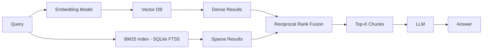

# Local Secure Hybrid RAG

> Work in progress...

This is a **Hybrid RAG** (Retrieval-Augmented Generation) pipeline that combines two
different retrieval methods and merges their results before generating an answer.

When a query comes in, it's sent down two parallel paths:

1. **Dense path (top)**: The query goes through an embedding model, which converts it into
   a vector. That vector is compared against a Vector DB to find semantically similar
   chunks — this is "dense retrieval," good at capturing meaning and paraphrase even when
   exact words don't match.
2. **Sparse path (bottom)**: The query also goes through a BM25 index, a classic
   keyword-based statistical ranking method. This is "sparse retrieval," good at exact
   term matches — acronyms, product codes, rare technical terms, names.

Both sets of results (Dense Results and Sparse Results) are then combined using
**Reciprocal Rank Fusion (RRF)** — an algorithm that merges ranked lists from different
retrievers into one unified ranking, without needing the two systems' scores to be on the
same scale.

The fused list produces **Top-K chunks**, which get passed to the **LLM** along with the
query to generate the final **Answer**.

## When to use Hybrid RAG

It works best when your queries are a mix of two needs: conceptual/semantic questions ("how
does our onboarding process work") and precise lookups (exact filenames, part numbers,
error codes, acronyms). Pure dense retrieval tends to miss exact-match terms
buried in noisy embeddings; pure BM25 misses semantic paraphrase. Hybrid covers both
failure modes at once, at the cost of running two retrieval systems and a fusion step.

## This RAG is designed to work with several different file formats

Given the heterogeneous mix (txt, Markdown, PDF, Word, PNG, Excel, subfolders), a hybrid
retrieval was chosen, but the harder problem in this case isn't dense-vs-sparse,
it's **normalization before retrieval even starts**:

- **PNGs** need OCR (or a vision-capable embedding step) before they can enter either
  index at all — they won't naturally produce good BM25 or embedding signal without that.
- **Excel** files often carry structured/tabular meaning that gets destroyed if it's
  naively chunked like prose — it may need a separate extraction path (e.g.,
  row/table-aware chunking, or a text summary of each sheet) rather than treating a
  spreadsheet like a paragraph.
- **PDF/Word** are usually the easiest — text extraction plus layout-aware chunking should
  work ok.
- BM25 is valuable here because a folder of real-world docs is exactly where filenames,
  IDs, and exact terminology matter and where a pure embedding search quietly fails.

A domain-customized approach for exactly a non-uniform corpus or data, a hybrid RAG is a
sound *retrieval-layer* choice — but the bigger design decision is the
**ingestion/normalization layer**: how each file type gets converted into clean, chunkable
text (and metadata like source type, folder path, file date) before it reaches the
embedding model or BM25 index. That metadata also supports weighting or filtering by file
type or folder at query time.

----

## High level plan

Use Ollama on a desktop (e.g., RTX 3080, 64GB RAM) and OpenClaw running on a separate VM
with the Signal app wired through signal-cli.

1. **Ingestion / file discovery** — Walk the Documents folder tree and catalog every file
   (path, type, size, modified date) to get a manifest to work from and that can track
   what's been processed already.

2. **Type-specific text extraction** — Build a per-file-type extractor (txt/Markdown pass
   through directly, PDF and Word via text extraction libraries, Excel via a table-aware
   extractor, PNG via OCR) that normalizes everything into plain text plus metadata
   (source path, file type, folder).

3. **Chunking** — Split extracted text into retrieval-sized chunks with overlap, tagged
   with their source metadata, so answers can later be traced back to a file.

4. **Indexing (the two RAG legs)** — Feed chunks into a vector DB using an embedding model
   (via Ollama) for dense retrieval, and build a BM25/keyword index for sparse retrieval —
   this is the Hybrid RAG pattern.

5. **Retrieval + fusion service** — Stand up a small local service that takes a query,
   hits both indexes, fuses results (RRF), and returns top-K chunks — this is the piece
   OpenClaw/Ollama will call.

6. **LLM answer generation** — Wire the retrieved chunks + query into Ollama's model to
   generate the final answer.

7. **Interface wiring** — Connect that retrieval+generation service as a tool/plugin
   OpenClaw can call when a Signal message comes in, so "ask a question" → Signal →
   OpenClaw → retrieval service → Ollama → answer → Signal reply.

8. **Maintenance loop** — A way to detect new/changed files in Documents and incrementally
   re-index them, rather than rebuilding everything each time.
